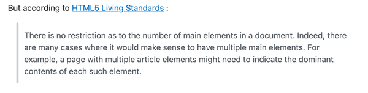

- [**INTRODUCTION**](#--introduction--)
- [UCD Phase 1: STRATEGY](#ucd-phase-1--strategy)
  * [PROJECT GOALS](#project-goals)
  * [External User Goals:](#external-user-goals-)
  * [Site Owner Goals:](#site-owner-goals-)
  * [Potential Features:](#potential-features-)
- [UCD Phase 2: SCOPE](#ucd-phase-2--scope)
    + [Analysis and grading of *Phase One considerations* allows a simple ***Strategy Table*** to be generated:](#analysis-and-grading-of--phase-one-considerations--allows-a-simple----strategy-table----to-be-generated-)
  * [Strategic Trade-offs](#strategic-trade-offs)
- [UCD Phase 3: STRUCTURE](#ucd-phase-3--structure)
  * [**nerdOmeter** Layout](#--nerdometer---layout)
- [UCD Phase 4: SKELETON](#ucd-phase-4--skeleton)
  * [Initial Wireframes for **nerdOmeter**](#initial-wireframes-for---nerdometer--)
- [UCD Phase 5: SURFACE](#ucd-phase-5--surface)
  * [DESIGN CHOICES](#design-choices)
  * [Fonts](#fonts)
  * [Colours](#colours)
  * [Imagery](#imagery)
  * [TECHNOLOGIES](#technologies)
  * [Languages](#languages)
  * [Tools](#tools)
  * [FEATURES](#features)
  * [Site-wide Features](#site-wide-features)
  * [Start Panel Features](#start-panel-features)
  * [Game Panel Features](#game-panel-features)
  * [Score Panel Features](#score-panel-features)
  * [Feedback Panel Features](#feedback-panel-features)
  * [*Features Left to Implement*](#-features-left-to-implement-)
- [VERSION CONTROL](#version-control)
  * [Gitpod Workspaces](#gitpod-workspaces)
- [TESTING](#testing)
  * [AUTOMATED TESTING](#automated-testing)
  * [jshint Validator Testing](#jshint-validator-testing)
  * [W3C Validator Testing](#w3c-validator-testing)
  * [MANUAL TESTING](#manual-testing)
  * [Manual Testing Results Summary](#manual-testing-results-summary)
  * [BUGS and FIXES](#bugs-and-fixes)
    + [**Bug: Duplicate images** in some gameplay runs](#--bug--duplicate-images---in-some-gameplay-runs)
    + [**Bug: Enter-as-SUBMIT** causes game glitch if used during gameplay runs](#--bug--enter-as-submit---causes-game-glitch-if-used-during-gameplay-runs)
    + [**Bug: Play Again button** fails to reset game panel correctly for another run](#--bug--play-again-button---fails-to-reset-game-panel-correctly-for-another-run)
    + [**Bug:**](#--bug---)
- [Deployment](#deployment)
  * [**Credits**](#--credits--)
    + [**Content**](#--content--)

<small><i><a href='http://ecotrust-canada.github.io/markdown-toc/'>Table of contents generated with markdown-toc</a></i></small>

----

# **INTRODUCTION**

The aim of this project is to utilise JavaScript, HTML & CSS to develop a fun-yet-challenging test for nerds everywhere: As Pokémon-spotting could arguably be considered one of the ultimate tests of nerd knowledge and geekdom, this project was originally envisioned as **PokéDeX•Trainer**, ***Gotta ID 'em ALL!***

However, given **Nintendo's** notorious [zero-tolerance approach to the use of their IPs](https://www.quora.com/Why-is-Nintendo-so-strict-about-copyright-laws), caution was obviously prudent. After seeking advice and following further [online research](https://www.buzzfeed.com/audreyworboys/fandom-logo-quiz), a different devious design was adopted for development: ***Behold the...***

----

# UCD Phase 1: STRATEGY 

## PROJECT GOALS

**nerdOmeter** aims to cater for nerds looking to test their nerdiness and prove their fandom knowledge. 

## External User Goals: 

- To test their nerd knowledge using a simple-yet-stylish interactive online experience
- Identify a random selection of **Fandom franchises** from their logos alone
- Option to request features and leave feedback via a prominent contact method 

  Additional ***user expectations*** for consideration include:
  - Intuitive/conventional navigation elements
  - Familiar and/or easily understandable site structure
  - Responsive: access site easily on any device

## Site Owner Goals:

- Develop a simple-yet-stylish interactive online test for nerdiness
- Offer the opportunity for other nerdy types to make contact and offer feedback/suggestions 
  
  Additional ***stakeholder concerns*** for consideration: 
  - Geeky, retro feel with some animated element(s) preferred; page background/icons/logo
  - Provide clear credits and image information for all logos utilised in the test 
  - The ability to easily expand and/or change the test material 

## Potential Features:

Considering the goals, expectations and concerns detailed above, potential features for the **nerdOmeter** site should include:
- A stylish, retro feel with easy, intuitive navigation/controls - and some animation!
- To test user's knowledge in an engaging-yet-challenging experience 
- Provide a prominent contact method for user interaction
- Potential to easily expand/change test content
- Potential for a Rankings or Leaderboard feature

---- 

# UCD Phase 2: SCOPE

### Analysis and grading of *Phase One considerations* allows a simple ***Strategy Table*** to be generated:

| OPPORTUNITY/PROBLEM/FEATURE                | IMPORTANCE | VIABILITY/FEASIBILITY | ID    | 
|--------------------------------------------|:----------:|:---------------------:|:-------
| Intuitive interactive online experience    | 5          | 4                     | A     |
| Fun & challenging test of knowledge        | 5          | 4                     | B     |
| Prominent contact options                  | 5          | 5                     | C     |
| Potential to expand/change content         | 4          | 5                     | D     |
| Potential for Ranking/Leaderboard feature  | 3          | 2                     | E     |
| TOTAL                                      | 22         | 20                    |       |

## Strategic Trade-offs

Plotting the Strategy Table results provides a visible indication of what is feasibily within the scope of the project at this time. As I am unable to meet all requirements at present, I will aim to provide **nerdOmeter** initially as an MVP or Minimum Viable Product, therefore: 
  Due to time and current-skill limitations the site will be developed in phases:

  ***Initial Phase:*** Delivery of MVP, a fully functioning website, with the exception of
    
  - Potential expansion of test material (primarily to increase user-challenge) withheld and focusing on a smaller subset of images (15) and shorter test length (5) in order develop working proof-of-concept 
  
  - Provision of Leaderboard/Ranking feature to be considered as/when time allows

----

# UCD Phase 3: STRUCTURE

## **nerdOmeter** Layout 

Rather than relying on multiple HTML and CSS pages, this project aims to primarily utilise JavaScript to control and affect the transitions and functions of a single-page online experience. To this end, and after careful consideration and [research](https://stackoverflow.com/questions/40141361/can-i-use-multiple-main-elements-in-a-multipage-document), the decision was made to contravene a pre-HTML5 convention and to utilise more than one `<main>` tag in the index.html; however, through the use of the `display:'block'` and `display:'none'` attributes, there is only ever one `<main>` element visible at a time.

---- 

# UCD Phase 4: SKELETON

## Initial Wireframes for **nerdOmeter**

Following current conventional practice, **nerdOmeter** was designed with a Mobile First approach.

----

 

----

All wireframes generated in [Balsamiq](https://balsamiq.com)

---- 

# UCD Phase 5: SURFACE

## DESIGN CHOICES

## Fonts

All fonts utilised in this project were sourced from and served by [**Google Fonts**](https://fonts.google.com)

- **Heading Font:** *Press Start 2P*
  
  *Press Start P2* is a cursive style font with a gamer-geek/retro-tech, pixellated appearance. It was chosen as it effectively conveys the nerdy aesthetic of both site focus and content.

- **Body Font:** *VT323*

  The monotype font *VT323* was chosen as a geeky, computer-themed compliment to *Press Start P2*.

## Colours

Colours utilised were chosen from the palette of the background video, with the **60:40:10 rule** in mind 

  • 60% Background/Primary - **#191970** *Midnight Blue*
  
  • 40% Body Text/Secondary: **#fff** *White* chosen for excellent contrast with Primary
  
  • 10% Accent/Tertiary: **#00ffff** *Cyan* chosen as a clean, fresh contrast to Primary and compliment to Tertiary

## Imagery

  • All the fandom franchise icons utilised in **nerdOmeter** are credited within the site via the modal link in the footer, in addition to this [nerdOmeter Image Credits PDF](readme_media/planning_docs/nerdOmeter.pdf) summary 

----

## TECHNOLOGIES

During the course of this project I have utilised the following technologies:

## Languages

- [**JavaScript**](https://www.javascript.com/) was used to add interactivity and enrich the User eXperience

- [**HTML5**](https://html.com/html5/) (HyperText Markup Language) was used for structuring & presenting site content

- [**CSS**](https://www.css3.info/) (Cascading Style Sheets) was used to provide styling to the HTML

## Tools

- [**favicon**](https://www.favicon.cc/) was used to create a unique favicon for **nerdOmeter**

  

- [**Git**](https://git-scm.com/) was used for version control (commit to Git and push to GitHub)

- [**Gitpod**](https://www.gitpod.io/) was used to write my code; an online IDE linked to the GitHub repository

- [**GitHub**](https://github.com/) was used to create the repository and store the project's code after being pushed from Git

- [**Chrome**](https://www.google.com/intl/en_uk/chrome/) used to debug & test source code using HTML5 and to test site responsiveness

- [**Balsamiq**](https://balsamiq.com) used to generate project site maps and wireframes

- [**Google Fonts**](https://fonts.google.com) used for all fonts utilised in the project

- [**amiresponsive**](http://ami.responsivedesign.is/) used to check how responsive the site is on different devices

- [**Web Page Test**](https://www.webpagetest.org/) used to test site performance

- [**JSHint**](https://jshint.com/), [**W3C Markup**](https://validator.w3.org/) and [**W3C Jigsaw**](http://jigsaw.w3.org/css-validator/) used to validate all source JavaScript, HTML & CSS code

## FEATURES

## Site-wide Features

**Site-wide Header with Logo and Dynamic Subheader**

  - The main site page employs a simple centred block styling, stacking the page elements under the main header
      
      • No nav elements required as all site navigations controlled via code and direct user inputs
  
  - A dynamic subheader directly below the main header carrys the **nerdOmeter** strapline ***The ULTIMATE nerd test!*** by default

      • During the *game* phase the subheader content asks the user the million-dollar-question; 'What is this logo from?' 

      • Subheader content is returned to default when the score panel activates at the end of the *game* phase

**Site-wide Animated Page Background**

  - The main Home page section consists of a royalty-free stock animated video (.mp4) background
  
    - Selected for it's retroesque-with-a-modern-twist look and feel of geeky video games and cartoons 

    - Sourced from ***Videezy***, as detailed in Contents
  

**Site-wide Footer** 

  - The footer section incorporates a JavaScript-controlled modal link containing image credits for all utilised images
  
  

  

## Start Panel Features

  - The start panel screen displays the premise of the game to first-time and returning users
  
  - The currently-disabled textbox placeholder copy invites users to 'Hit NERD IT to play!'
  
  - Clicking NERD IT initiates the game
  
  - FEEDBACK button is disabled until post-game 

 

## Game Panel Features

  - The game panel screen displays a random icon from the master array
  
  - User info text appears below the screen informing the user which round they are playing out of 5
  
  - Textbox is activated, placeholder text asks the user to type their answer
  
  - Button functions change to SUBMIT and PASS/NEXT, allowing users to skip the hard ones

  - After answer submit an alert informs the user if they were correct or incorrect
    - Incorrect alert panel informs the user of the correct answer

  - After alert dismissed another random icon is displayed

  - Each game consists of 5 unique logos chosen randomly from a pool of 15

  - After 5 rounds the game ends and the score panel is displayed

## Score Panel Features

  - The score panel screen content congratulates the user and returns their score out of 5

  - Subheader copy is reverted back to default

  - Textbox placeholder copy thanks users for playing and asks if they want to try again

  - Button functions change to PLAY AGAIN and FEEDBACK (now active)

## Feedback Panel Features

  - The feedback panel screen consists of a 'Feedback Appreciated!' header and copy encouraging users to get in touch

  - A simple `<form>` element captures user name, email address & message (all required fields)

  - Textbox placeholder copy thanks users for their feedback

  - Button functions change to PLAY AGAIN and FEEDBACK (disabled)

## *Features Left to Implement*

- Identified as **Strategic Trade-offs** at ***UXD Phase 2***, a **Ranking System** and **Test Expansions** will be addressed, skills and time permitting, as and when possible.

----

# VERSION CONTROL

Managed within **GitHub** and **Gitpod** via regular commits pushed to GitHub remote servers:

## Gitpod Workspaces
1. Starting from GitHub, clone the Code Institute template by clicking Use This Template and copying to my repo. Launch Workspace by clicking GitPod button - this action is only performed once and the workspace is subsequently reopened through GitPod.

2. Start the Gitpod Workspace which opens an online IDE editor window.
    
    - Update GitHub by committing from GitPod

3. During editing save the code regularly, using git add ., git commit -m "commit message here" and git push Bash commands to push changes to the GitHub repository.

4. Meaningful commit messages allow easy roll-back of any changes to earlier versions.

# TESTING 

## AUTOMATED TESTING

## jshint Validator Testing 

- JavaScript
  - No errors were returned when passing through the [JSHint validator](https://jshint.com/)

## W3C Validator Testing 

- HTML
  - No errors were returned when passing through the [(X)HTML5 Validator](https://html5.validator.nu/)

- HTML
  - 3 errors were returned when passing through the official [W3C validator](https://validator.w3.org)
    - These relate to the outdated convention of only *ever* using one `<main>` tag

- CSS
  - No errors were found when passing through the official [(Jigsaw) validator](https://jigsaw.w3.org)

**Google Developer Tools**

- I made use of the built-in **Chrome Dev Tools** to experiment and debug while coding, in addition to testing simulated responsive behaviour across a wide range of mobile and desktop devices, and finally checking all pages Performance using **Lighthouse**. 

**Response Testing**

In order to make sure that RJW Illustration was responsive to all device sizes, I used [amiresponsive](http://ami.responsivedesign.is/)

**WebPageTest**

- I used [WebPageTest](https://www.webpagetest.org/) set to London/Chrome as a final test for **nerdOmeter**.

## MANUAL TESTING

In addition to my own testing a link to the project was shared to family & friends for rigorous testing across varied devices and screen sizes.

  - **Browsers** including: 
    - Chrome
    - Safari
    - Edge

  - **Devices** including: 
    - iPhone SE (Gen 1)
    - iPhone 11
    - iPhone 12 Mini
    - Google Pixel 4a
    - iPad Pro (2018)
    - iPad Air (2020)
    - MacBook Pro (2015)
    - Windows 10 PC 

## Manual Testing Results Summary

**Main Start Page**

| TEST | OUTCOME | PASS/FAIL |
|---|---|:---:|
| Header & Footer | Ensure all header, footer & button elements behave as expected: Active/Hover states; Modal | PASS |
|  | Ensure all styled responsive behaviour rules are met as expected | PASS |
|  | Ensure modal link behave as expected and display correct info | PASS |
| Background Video | Ensure appropriate behaviour across-site: loads & plays; response scaling; | PASS |
| Inputs | Ensure button functions perform as expected [x2] | PASS / N-A |
| Responsive | Ensure responsive behaviour rules are met as expected | PASS |

**Game panel**

| TEST | OUTCOME | PASS/FAIL |
|---|---|:---:|
| Sub | Ensure dynamic subheader copy is correct | PASS |
| Image | Ensure expected behaviour: unique; random; displayed correctly | ~~BUG!~~ PASS |
| Gameplay | Ensure game loops and features work as expected: | BUG! |
| Gameplay | Ensure game answer checking works as expected: letter case matching; answers are correct! | PASS |
| Gameplay | Ensure game score tracking works as expected: logs correct / incorrect | PASS | 
| Inputs | Ensure button functions perform as expected | PASS |
| Inputs | Ensure Enter-as-SUBMIT function performs as expected: | BUG! |
| Responsive | Ensure responsive behaviour rules are met as expected | PASS |

**Score panel**

| TEST | OUTCOME | PASS/FAIL |
|---|---|:---:|
| Sub | Ensure dynamic subheader copy is correct | PASS |
| Score | Ensure expected behaviour: correct value returned | PASS |
| Inputs | Ensure button functions perform as expected [x2] | BUG! / PASS |
| Responsive | Ensure responsive behaviour rules are met as expected | PASS |

**Feedback panel**

| TEST | OUTCOME | PASS/FAIL |
|---|---|:---:|
| Form element | Ensure expected behaviour: Validation; confirmation | PASS |
| Inputs | Ensure button functions perform as expected [x2] | BUG! / N-A |
| Responsive | Ensure responsive behaviour rules are met as expected | PASS |

## BUGS and FIXES

### **Bug: Duplicate images** in some gameplay runs
  
  • *Issue:* Duplicate icons appearing during some games
  
  • *Fix:* Identified and rectified a coding error in JavaScript RNG function

### **Bug: Enter-as-SUBMIT** causes game glitch if used during gameplay runs
  
  • *Issue:* Pressing Enter rather than submit to post answers causes the game to play itself and complete the remaining rounds with wrong answers. This feature has previously been working as expected but now glitches the game. Really frustrating! 
  
  • *Fix:* Pending... but considering disabling the feature in a worst-case scenario!

### **Bug: Play Again button** fails to reset game panel correctly for another run
  
  • *Issue:* Clicking Play Again on the score or feedback panels takes user back to the game panel but doesn't reset and reload the game again properly; the icon & answer from the previous game still populates the screen & textbox; round-count is still set at 5/5; unable to interact with user inputs. 
  
  • *Fix:* Pending...

### **Bug:**
  
  • *Issue:* 
  
  • *Fix:* 

# Deployment

- The site was deployed to GitHub pages. The steps to deploy are as follows: 
  - In the GitHub repository, navigate to the Settings tab 
  - Click the Pages section in the sidebar
  - From the source section drop-down menu, select the main branch
  - Once the main branch has been selected, the page will be automatically refreshed with a detailed ribbon display to indicate the successful deployment. 

The live link can be found here - https://alfa23.github.io/portfolio-project-two/ 

## **Credits**

### **Content**

• **All document fonts** sourced from google fonts: https://fonts.google.com/specimen/VT323?preview.text=nerdOmeter&preview.text_type=custom&category=Monospace#standard-styles

• **Game content selection** informed/inspired by & borrowed/adapted from an online nerd challenge @: https://www.buzzfeed.com/audreyworboys/fandom-logo-quiz

• **Background Video** sourced from: https://www.videezy.com/abstract/53213-3d-render-sci-fi-neon-corridor 

• **Consistent footer** behaviour controlled using learnt, borrowed and adapted css-grid code from: https://dev.to/niorad/keeping-the-footer-at-the-bottom-with-css-grid-15mf

• **Page background video** modified code from https://w3collective.com/fullscreen-video-background/

• **Modal box** for footer/image credits learnt, borrowed and adapted css-grid code from: https://www.w3schools.com/howto/howto_css_modals.asp 

